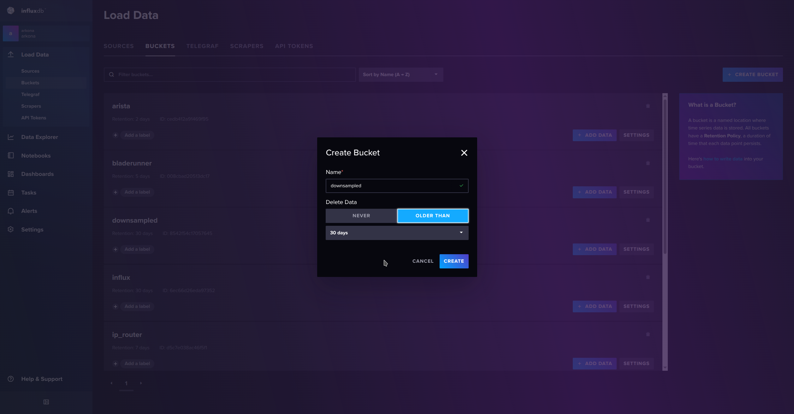
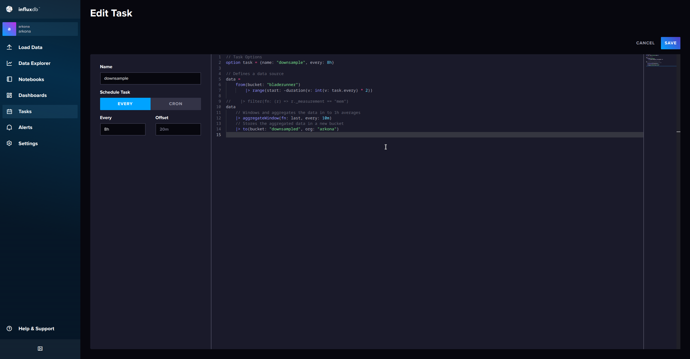
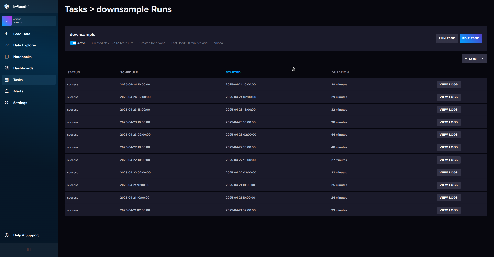
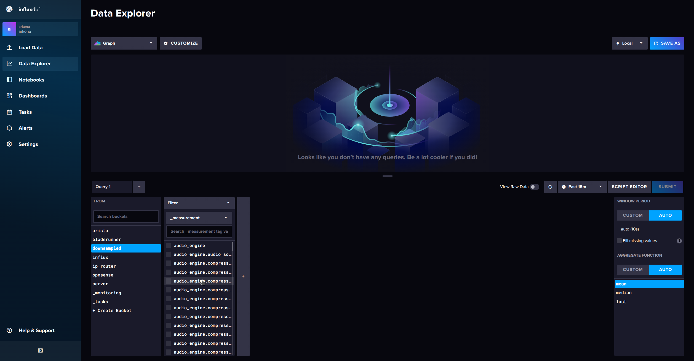
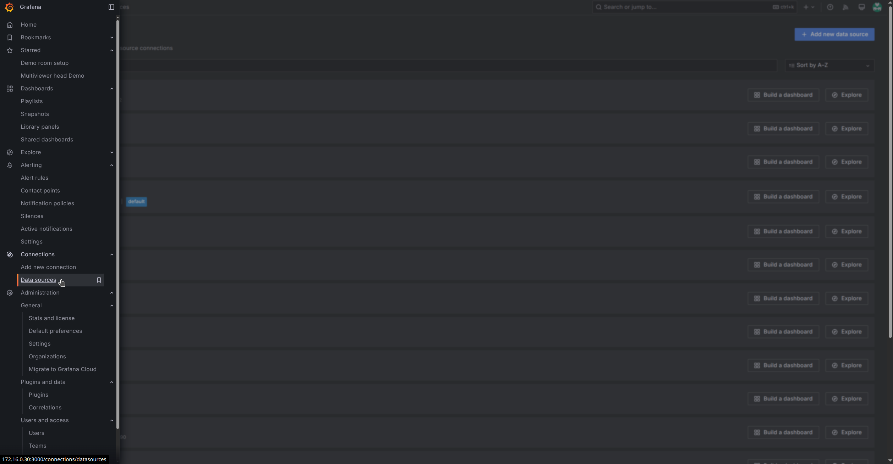
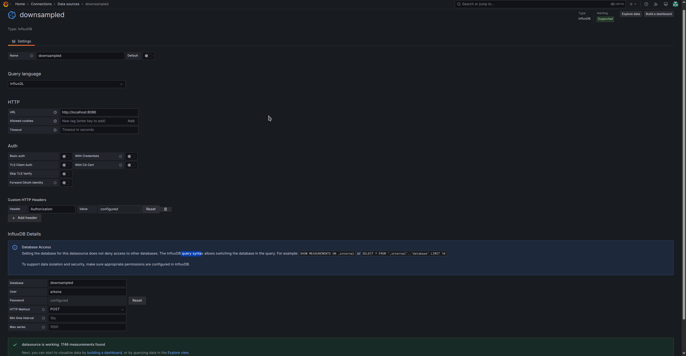
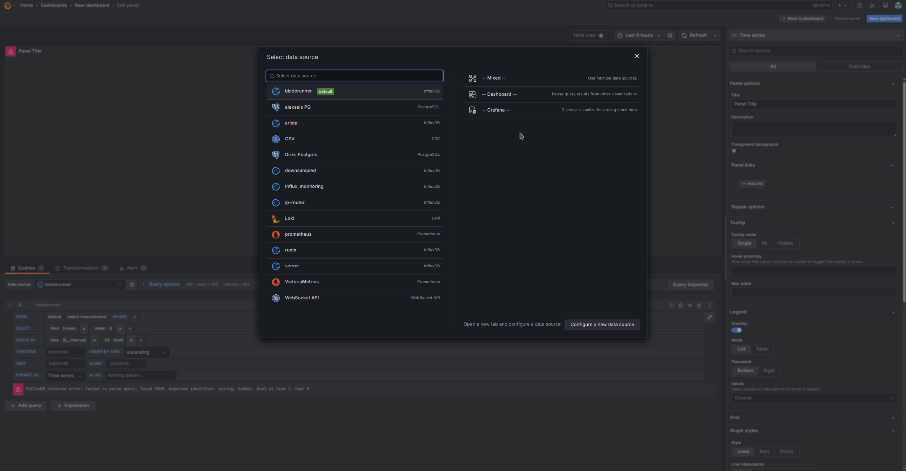
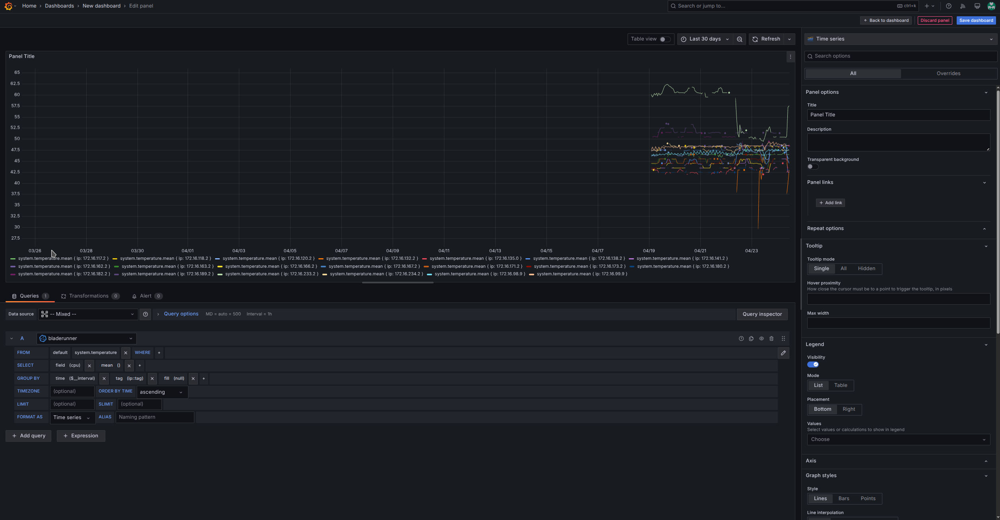
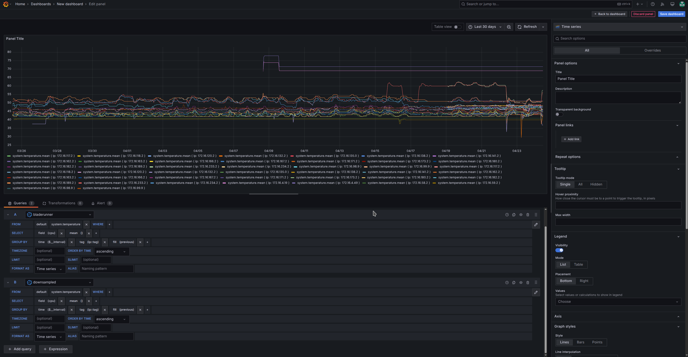
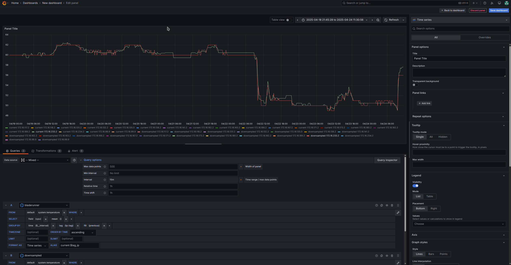

# Optional InfluxDB configuration

## Downsampling data

To downsample data in influxDB, you need:

- A source bucket
- A target bucket
- A scheduled task

In this example we'll take "bladerunner" as our source bucket, where all the BLADE//runner data gets written into and we create a "downsampled" bucket.

Log in to your influxDB (browser: `http://wherever-your-influxDB-is-installed:8086`), go to `Load Data - buckets` and click on "Create bucket".



Then go to `Tasks` and click on "Create task"



You can schedule the task via cron job or as in the picture with the option "Every" and a time period.

In the editor, paste:

```
// Task Options
option task = {name: "downsample", every: 8h}

// Defines a data source
data =
    from(bucket: "bladerunner")
        |> range(start: -duration(v: int(v: task.every) * 2))
//    |> filter(fn: (r) => r._measurement == "mem")

data
    // Windows and aggregates the data in to 1h averages
    |> aggregateWindow(fn: last, every: 10m)
    // Stores the aggregated data in a new bucket
    |> to(bucket: "downsampled", org: "arkona")
```

which will downsample data with an aggregate window of 10 minutes.
You can also filter which measurement should be transferred as is seen in the outcommented line containing "filter". Keep everything as is if you want to get all measurements.

Click on "Save" and check if the task is set to "active". Click "Run task" to intially test it.



Go to `Data explorer` and check if measurements are shown on selection.



### Show data from two buckets in Grafana

If you want to create a graph in Grafana that shows data from the "bladerunner" bucket and also from "downsampled", you need first add a connection to the "downsampled" bucket.

In your Grafana (http://wherever-your-grafana-is:3000), go to `Connections - Data sources` and click on "Add net data source"



In the form, add the following data:

- name: downsampled
- http url: http://wherever-your-influxDB-is-installed:8086
- custom http header: add header
  - Header: Authorization
  - Value: `Token <your-token-from-the-.env-file>`
- database: downsampled
- user: `$DB_USER` (from your .env file)
- password: `$DB_PASSWORD` (from your .env file)

>[.env file](../README.md#installation)



If you for any reason shouldn't have your admin token or want to restrict permissions, you can create a new token for your "downsampled" bucket, see [docs.influxdata: create a custom token](https://docs.influxdata.com/influxdb/cloud/admin/tokens/create-token/#create-a-custom-token)

Click on "save & test", you should see a green notification "datasource is working".

Afterwards, you can edit an existing dashboard or create a new one in `Dashboards` with "New" and "add visualization".



For the datasource, select "mixed" on the right side.

Then, set the time period to something bigger than your retention policy, e.g. 30 days and create a query for the "bladerunner" bucket. In this example we'll get some cpu temperatures.



You see that the data is not older than some days, now you can duplicate the query and select "downsampled" as the data source for the second query.



>NOTE: 
> 1. You may have to change the time period again or click refresh to apply the changes.
> 2. You won't see any older data immediately __if you just added the downsampled bucket__. To see if the bucket does work, hide the first query and you should still see data.
> 3. You can make far more complex queries and the measurements from both datasources will overlap, to get a better overview, set aliases for the queries, like `current $tag_ip` for "bladerunner" and `downsampled $tag_ip` for "downsampled".
> 4. As the downsampled data is coarsely resolved, the overlapping lines often won't match exactly as you can see in the picture below.

