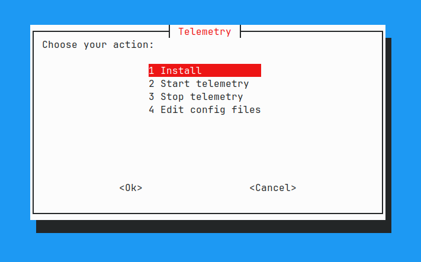
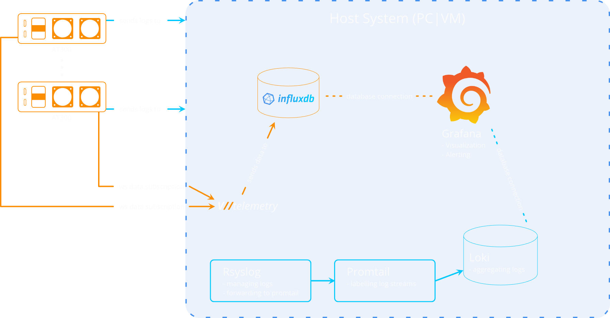

# Arkona Technologies Telemetry Template (version 2)


## Overview

`telemetry-template` is a containerized software package for monitoring multiple Arkona Technologies BLADE//runner processors. This repository provides a Docker Compose setup to conveniently deploy the telemetry service, InfluxDB, and Grafana. The Docker Compose file provisions both the database and Grafana installation, eliminating the need for additional configuration.

**If you, for somewhat reason, want an even simpler setup with influxdb 1.8, switch to "main" branch**

## Features

- **Convenient Setup:** Use Docker Compose to easily set up the telemetry service, InfluxDB, and Grafana.
- **Integrated Database:** The setup provisions InfluxDB, a powerful and efficient time-series database, for storing telemetry data.
- **Visualization with Grafana:** Grafana is included in the setup, providing a user-friendly interface for visualizing and analyzing telemetry data.
- **Scalable Monitoring:** Monitor multiple BLADE//runner processors seamlessly with the scalability of containerized deployments.
- **Added features in version 2 (compared to main branch):**
   - Using influxDB version ^2.7
   - Setting up rsyslog, loki and promtail to provide syslog inspection via Grafana

## Prerequisites

Before deploying the Docker Compose setup, ensure the following prerequisites are met:

- Docker installed on the host machine.
- Docker Compose installed on the host machine.
- Apt package manager, otherwise rsyslog has to be installed manually before setup

## Installation

1. Clone this repository to your local machine:

   ```bash
   git clone https://github.com/arkona-technologies/telemetry-template.git
   ```

2. Navigate to the project directory and select new branch:

   ```bash
   cd telemetry-template
   git checkout v2
   ```

3. Create a `.env` file in the project root with your desired configurations. Use the provided `.env` file as a template:

4. **Configure via `.env` file:** Customize the `.env` file as needed, specifying parameters such as processor IPs, ports, and authentication details. Example configuration in `.env`:

   ```env
   BLADES=172.16.10.2

   DB_NAME=bladerunner
   DB_PASSWORD=blade__runner # at least 8 characters!
   DB_USER=test
   DB_PORT=8086
   DB_ORG=myorg
   DB_RETENTION=7d # can be n d/w/m/y (days/weeks/months/years)
   DB_TOKEN=

   GRAFANA_USER=test
   GRAFANA_PW=test
   ```

5. Execute the setup script:

   ```bash
   ./run.sh
   ```

   This command will try to setup rsyslog first, so please provide the sudo password when asked. Afterwards it will run a setup instance of influxDB to provide the mandatory authorization token and finally start the telemetry service, InfluxDB, Loki, Promtail and Grafana in detached mode.

   You can alternatively use the whiptail wizard for a simpler overview by executing:
   ```bash
   ./wizard.sh
   ```



6. Access Grafana at [http://localhost:3000](http://localhost:3000) in your browser. Log in with the supplied credentials.

7. Create dashboards in Grafana to visualize telemetry data from BLADE//runner processors. Take a look at the supplied Dashboards as a guide.

## Overview




<!-- ## Overview

```mermaid
graph LR
   classDef blade fill:#00214c,stroke:#f8a433,stroke-width:2px;
   classDef blade fill:#000,stroke:#f8a433,stroke-width:2px;
   grafana("Grafana")
   influxdb[("InfluxDB")]
   loki[("Loki")]
   promtail("Promtail")
   vtel("V//telemetry")
   rsyslog("Rsyslog \n Collects data from host")
   blade1("AT300 #1")
   blade2("AT300 #2")
   blade3("AT300 #3")
   bladen("AT300 #n")
   class blade1,blade2,blade3,bladen blade
   vtel -. subscribes data from .- blade1
   vtel -. subscribes data from .- blade2
   vtel -. subscribes data from .- blade3
   vtel -. subscribes data from .- bladen
   blade1 == sends logs to ==> Host
   blade2 == sends logs to ==> Host
   blade3 == sends logs to ==> Host
   bladen == sends logs to ==> Host
   subgraph Host
   direction TB
      
      vtel == pushes data to ==> influxdb
      influxdb == fetches data from ==> grafana
      promtail == aggregates data from ==> loki
      promtail 
      rsyslog == forwards logs to ==> promtail
   end
``` -->

## A brief excerpt of features

- Filtered / Sorted Logging of all devices that are logging to the telemetry stack with Loki
- Flexible alarming system with Grafana
- Shareable and embeddable dashboards
   - e.g. to display in a manifold multiviewer head
      - currently you're bound to grafana version 9 for that, soon will be updated to support latest grafana versions
- BLADE//runner specific images for use in grafana canvas panels, to use those, execute:

   `ls ./grafana/images/* | xargs -I {} docker cp {} telemetry-template-grafana-1:/usr/share/grafana/public/img/icons/iot/`

   from the telemetry directory (note: the name "telemetry-template-grafana-1" could differ)

# Hardware recommendations

As a very rough recommendation there are two scenarios:

Small installations like up to 8 blades with the default configuration can be monitored by a mid range PC, roughly: {cpu: i5/Ryzen 5, ram: 16GB RAM, disk: SSD}.

Bigger installations like up to ~40 blades or more* with the default configuration can be monitored by a higher range PC (i7/i9/Ryzen 7/Ryzen 9, 64GB RAM, SSD raid). It scales better with more cores/threads than pure clock speed. 64GB of RAM are not needed, but 32GB could be right at the edge without any in-mem handling for the database, and therefore not recommended for that scenario.

> *Provided numbers are to be handled with caution. The lab has around 45 blades running, all being monitored on one server (32 core EPYC, 192GB RAM, SSD raid), data stored for 7d plus downsampled data for a year plus some other data and services with a load of 30GB RAM used, 140GB RAM cached for influx, 30% CPU in average.

## Links

- [VTelemetry2](https://hub.docker.com/r/arkonatechnologies/vtelemetry2)
- [InfluxDB](https://hub.docker.com/_/influxdb)
- [Grafana-OSS](https://hub.docker.com/r/grafana/grafana-oss)
- [Loki, Promtail](https://grafana.com/docs/loki/latest/send-data/promtail/)
- [Rsyslog](https://www.rsyslog.com/doc/index.html)
- [Docker](https://www.docker.com/)

## Further Reading
- [Arista EOS Telemetry ](https://arista.my.site.com/AristaCommunity/s/article/streaming-eos-telemetry-states-to-influxdb)
- [Cisco Telemetry](https://ultraconfig.com.au/blog/cisco-telemetry-tutorial-with-telegraf-influxdb-and-grafana/)
- [General Linux Server Telemetry](https://community.hetzner.com/tutorials/server-monitoring-using-grafana-and-influxdb)

## License

This project is licensed under the [MIT License](LICENSE).

## Contributing

Feel free to contribute by submitting issues or pull requests. Your feedback is valuable to us!

