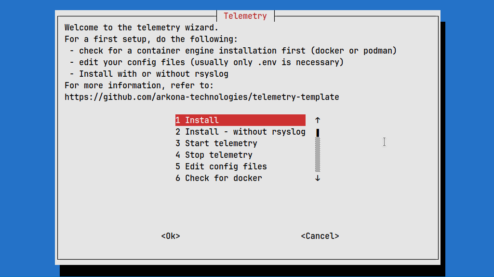
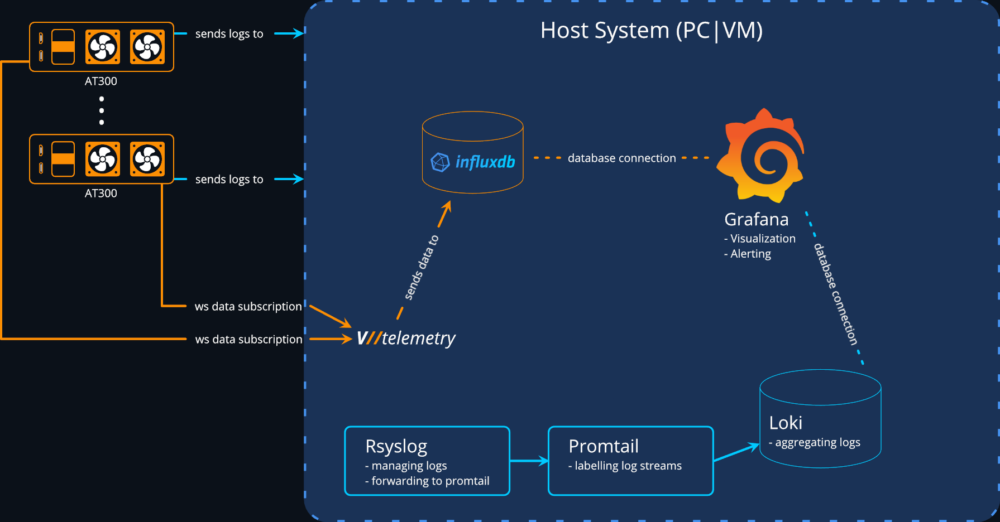

<!--  -->

# Arkona Technologies Telemetry Template (version 3)

> **NOTE !! Please read through the [prerequisites](#prerequisites) and [hardware recommendations](#hardware-recommendations) first**

> **NOTE !! Default retention policy is FOUR DAYS**
- You can edit that in the .env files "RETENTION_PERIOD"
- InfluxDB3 core does NOT ALLOW changing retention policies afterwards, those are set on database creation

> **NOTE !! This is a template. There is *NO GUARANTEE* that applied settings are the optimum for your individual usage.**

## Overview

`Telemetry-template` is a containerized software package for monitoring multiple Arkona Technologies BLADE//runner processors. This repository provides a Docker Compose setup to conveniently deploy the telemetry service, InfluxDB, and Grafana. The Docker Compose file provisions both the database and Grafana installation, eliminating the need for additional configuration.


## Features

- **Convenient Setup:** Use Docker Compose to easily set up the telemetry service, InfluxDB, and Grafana.
- **Integrated Database:** The setup provisions InfluxDB, a powerful and efficient time-series database, for storing telemetry data.
- **Visualization with Grafana:** Grafana is included in the setup, providing a user-friendly interface for visualizing and analyzing telemetry data.
- **Scalable Monitoring:** Monitor multiple BLADE//runner processors seamlessly with the scalability of containerized deployments.
- **Added features in version 3 vs 2:**
   - Using influxDB version ^3.10

## Prerequisites

Before deploying the Docker Compose setup, __*ensure the following prerequisites are met*__:

1. Apt package manager, otherwise rsyslog has to be installed manually before setup
2. Create a partition for telemetry data separated from the OS __(not `/` or `/home`)__ and make sure that the partition you use presumably has enough free space
   - __! read the [hardware recommendations](#hardware-recommendations) before installing !__
   - When you use the wizard, it will show the free space of the partition your telemetry directory is on
- Check the amount of memory and if limits should be set (especially for permanent installations - _advanced_)
   - This can be done in the wizard and changed in the .env file
      - The wizard option "1 Pre-allocate memory limits" will determine recommended settings for the containers based on how much total RAM is available on the host.
   - Limits can prevent containers and/or the host to run into OOM issues. Be aware that:
      - Setting container memory limits could also trigger OOM kill commands on the container if the application exceeds the limit.
      - Podman or a _rootless_ docker installation might run into permission issues when trying to set cgroup memory limitations

> **NOTE !! Settings like memory limits or the amount of free disk space are just recommended defaults which are heavily dependent on the actual environment and usage. There is *NO GUARANTEE* that applied settings are the optimum for your individual usage. !!**


## Installation

You can install the package in different ways, depending on the use-case. The default is an easy installation where everything, including the database, runs in containers. The options are:

<table><tr><th>Just get me going (DEFAULT)</th><th> I want to set up an optimized monitoring environment</th></tr>
<tr>
<td>If you want to try out the vtelemetry package or just want to setup monitoring as quickly and easy as possible, just follow the instructions below.</td>
<td>If you want to have an optimized environment for long-term installations in larger facilities that might also grow, please read through the <a href=".readme/optimizations.md">optimization recommendations</a> first.</td>
</tr>
</table>

1. Clone this repository to your local machine:

   ```bash
   git clone https://github.com/arkona-technologies/telemetry-template/tree/v3.git
   ```

2. Go into the telemetry-template directory and open the wizard with `./wizard.sh`

3. Go to "5 Edit config files" -> .env to configure the provided `.env` file selecting the editor you want.

4. **Configure via `.env` file:** Customize the `.env` file as needed, specifying parameters such as processor IPs, ports, and authentication details. Save and close the editor afterwards to get back to the wizard.

   ```env
   BLADES=172.16.10.2,172.16.20.2

   DB_NAME=bladerunner
   DB_PASSWORD=blade__runner # at least 8 characters!
   DB_USER=arkona
   DB_PORT=8086
   DB_ORG=arkona
   RETENTION_PERIOD=7d # can be n d/w (days/weeks)
   DB_TOKEN=

   GRAFANA_USER=arkona
   GRAFANA_PW=arkona
   ```

5. Go to the main menu and select "Install"

   It will first look if docker or podman is available as a command. If not it will tell to install one of them via the wizard, when installed the command has to be run again.
   If docker or podman is installed, the command will try to setup rsyslog first, so please provide the sudo password when asked. Afterwards it will run a setup instance of influxDB to provide the mandatory authorization token and finally start the telemetry service, InfluxDB, Loki, Alloy and Grafana in detached mode.



>The wizard tries to enable a simple setup on a variety of systems, so if you run into issues, please provide feedback on which system you had trouble. Besides providing some overview it tries to cover essential setup steps like installing a missing docker or podman installation, setting lingering for users and more.

6. Access Grafana at [http://localhost:3000](http://localhost:3000) in your browser. Log in with the supplied credentials.

7. Create dashboards in Grafana to visualize telemetry data from BLADE//runner processors. Take a look at the supplied Dashboards as a guide.

## Overview




<!-- ## Overview

```mermaid
graph LR
   classDef blade fill:#00214c,stroke:#f8a433,stroke-width:2px;
   classDef blade fill:#000,stroke:#f8a433,stroke-width:2px;
   grafana("Grafana")
   influxdb[("InfluxDB")]
   loki[("Loki")]
   alloy("Alloy")
   vtel("V//telemetry")
   rsyslog("Rsyslog \n Collects data from host")
   blade1("AT300 #1")
   blade2("AT300 #2")
   blade3("AT300 #3")
   bladen("AT300 #n")
   class blade1,blade2,blade3,bladen blade
   vtel -. subscribes data from .- blade1
   vtel -. subscribes data from .- blade2
   vtel -. subscribes data from .- blade3
   vtel -. subscribes data from .- bladen
   blade1 == sends logs to ==> Host
   blade2 == sends logs to ==> Host
   blade3 == sends logs to ==> Host
   bladen == sends logs to ==> Host
   subgraph Host
   direction TB
      
      vtel == pushes data to ==> influxdb
      influxdb == fetches data from ==> grafana
      alloy == aggregates data from ==> loki
      alloy 
      rsyslog == forwards logs to ==> alloy
   end
``` -->

## A brief excerpt of features

- Filtered / Sorted Logging of all devices that are logging to the telemetry stack with Loki
- Flexible alarming system with Grafana
- Shareable and embeddable dashboards
- BLADE//runner specific images for use in grafana canvas panels, to use those, execute:

   `ls ./grafana/images/* | xargs -I {} docker cp {} telemetry-template-grafana-1:/usr/share/grafana/public/img/icons/iot/`

   from the telemetry directory (note: the name "telemetry-template-grafana-1" could differ)

## Optional configuration

NOTE: The credential system for influx3 has changed, but data ingestion is compatible to v2, though there is only a token, user, password, organization are just being ignored.

<!-- - [Downsampling data in influxDB > v1](.readme/optional-configuration.md#-Downsampling-data) -->
- [Monitor Arista switches](.readme/arista.md)
- [Monitor manifold](.readme/manifold.md)
- [Triggering GPO with GET requests via Grafana](https://github.com/Grimmoth/grafanaGETbridge/tree/main)
   - Small tool that can be used to trigger API requests on alarms that require http GET method which is not supported by Grafana out-of-the-box.

## Influx commands

- [Querying with CLI (and export)](https://docs.influxdata.com/influxdb3/core/query-data/execute-queries/influxdb3-cli/)
   ```
   influxdb3 query \
     --host "http://your-source-influx:8181" \
     --database "your_source_db" \
     --token "your_source_token" \
     --format parquet \
     --output ./export_last_2_days.parquet \
     "SELECT * FROM your_measurement_table WHERE time >= NOW() - INTERVAL '2 DAYS'"
   ```
- [Writing with CLI (and import)](https://docs.influxdata.com/influxdb3/core/get-started/write/#write-data-using-the-cli)
   - to be able to read the file, move it into `<telemetry-template>/influxdb3/data/` on the host
   - using the cli in the influx container, the file path will be mounted on `/home/influxdb3/.influxdb3`
   - influx uses 1500:1500 permissions 
   ```
   influxdb3 import upload \
     --host "http://your-destination-influx:8181" \
     --database "your_destination_db" \
     --token "your_destination_token" \
     ./export_last_2_days.parquet
   ```
- [Write data with telegraf (from csv file)](https://docs.influxdata.com/influxdb3/core/write-data/use-telegraf/csv/)

# Hardware recommendations

As a very rough recommendation there are two scenarios:

Small installations like up to __8__ blades with the default configuration can be monitored by a mid range PC. 
- __minimum requirements__: {cpu: __i5/Ryzen 5__, ram: __16GB RAM__, disk: __SSD__ with __200GB__ space}.

Bigger installations like __40__ blades or more** with the default configuration can be monitored by a higher range PC or server.

- __minimum requirements__: {cpu: __i7/i9/Ryzen 7/Ryzen 9/__,ram: __64GB RAM__,disks: __SSD raid10 with 500GB__ space}.
   - It scales better with more cores/threads than pure clock speed. Server CPUs with more cores (24+) are recommended.
   - More RAM is better as the system responds much better the more data it can hold in memory

> **Provided numbers are to be handled with caution as they can differ due to setup and usage. Our lab has around 45 blades running, all being monitored on one server (32 core EPYC, 192GB RAM, SSD raid10, data stored for 7d plus downsampled data for a year plus some other data and services with a load of 30GB RAM used, 140GB RAM cached for influx, 30% CPU in average and __*~300GB*__ of data in influx.

> For hosts with limited resources it is recommended to set memory limits for containers and applications in the wizard to avoid exceeding the capabilites.

## Links

- [VTelemetry2](https://hub.docker.com/r/arkonatechnologies/vtelemetry2)
- [InfluxDB](https://hub.docker.com/_/influxdb)
- [Grafana-OSS](https://hub.docker.com/r/grafana/grafana-oss)
- [Loki, Alloy](https://grafana.com/docs/loki/latest/send-data/alloy/)
- [Rsyslog](https://www.rsyslog.com/doc/index.html)
- [Docker](https://www.docker.com/)

## Further Reading

- [Optimizing your environment](.readme/optimizations.md#optimize-your-environment-for-the-database)
- [Arista EOS Telemetry ](https://arista.my.site.com/AristaCommunity/s/article/streaming-eos-telemetry-states-to-influxdb)
- [Cisco Telemetry](https://ultraconfig.com.au/blog/cisco-telemetry-tutorial-with-telegraf-influxdb-and-grafana/)
- [General Linux Server Telemetry](https://community.hetzner.com/tutorials/server-monitoring-using-grafana-and-influxdb)

## License

This project is licensed under the [MIT License](LICENSE).

## Contributing

Feel free to contribute by submitting issues or pull requests. Your feedback is much appreciated!

